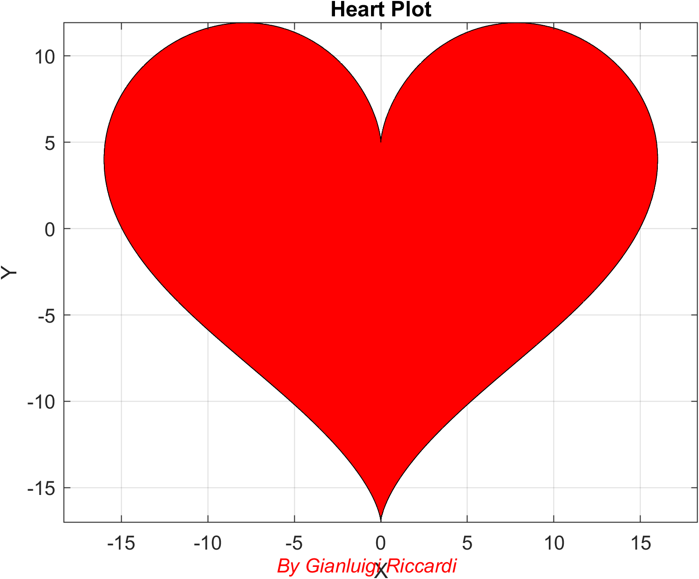

# HeartPlot-MATLAB
A parametric heart shape plotted in MATLAB. ❤️ Ideal for Valentine’s Day or for showing love through math.
# HeartPlot-MATLAB ❤️

This is a simple and elegant project that draws a heart shape using parametric equations in MATLAB.

## 💡 What it does

The script uses a set of sine and cosine functions to generate a heart shape and plot it with a red curve.  
It’s ideal for exploring mathematical beauty or for publishing a fun visual on social media.

## 🛠️ How to use

1. Open `heart_plot.m` in MATLAB.
2. Run the script.
3. A figure will display the heart, and an image will be saved as `heart_plot.png`.

## 📷 Output

## 🔓 License

This project is licensed under the MIT License. Feel free to use it, modify it, and share it!

## 🙌 Author

**Gianluigi Riccardi**  
*UnderGraduate Engineer & AI enthusiast focused on predictive maintenance with MATLAB and Simulink.*
